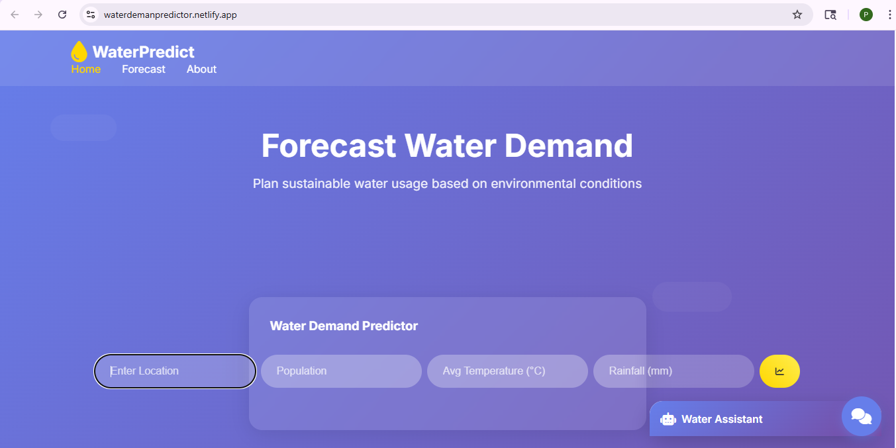
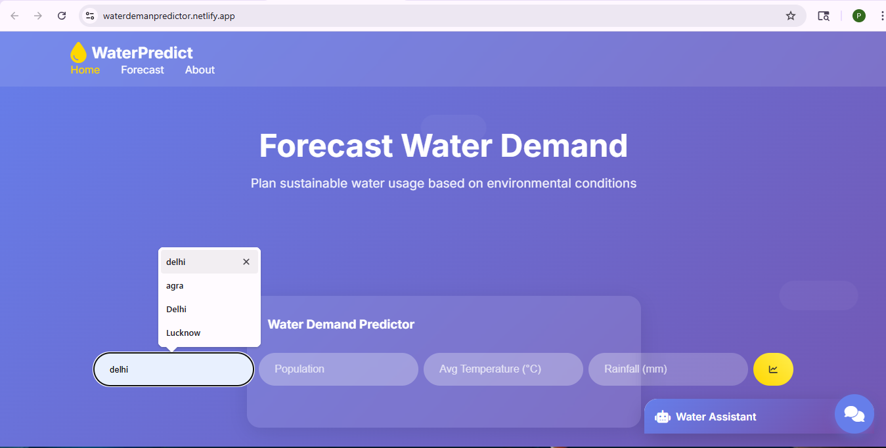
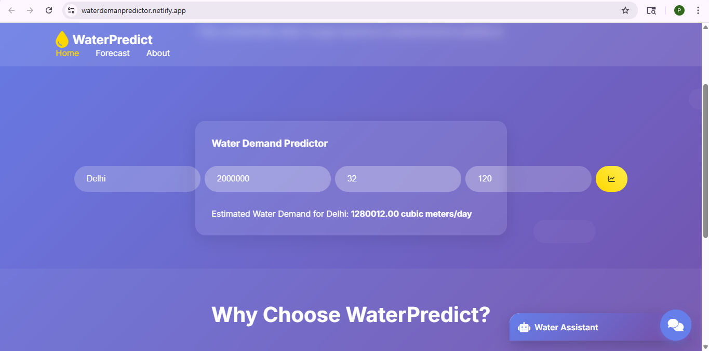
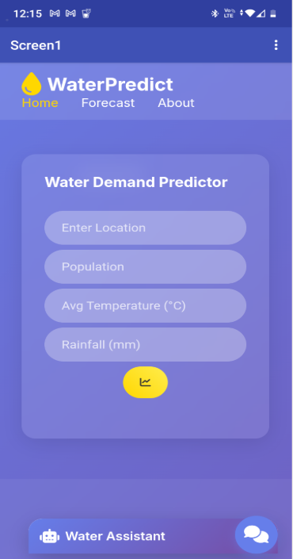

# Water-Demand-Predictor
AI-powered water demand prediction system using IBM Watson.
## Screenshots
### Homepage

### Input Data of Area

### Prediction Results

How Prediction Works

This project uses an IBM Watson Machine Learning deployed model.

The frontend collects user input
The data is sent to the IBM Cloud API
The API returns predicted water demand
The result is displayed on the website

### Mobile view

